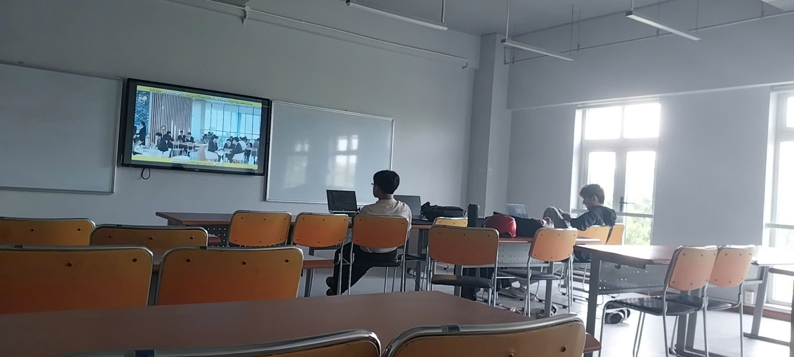
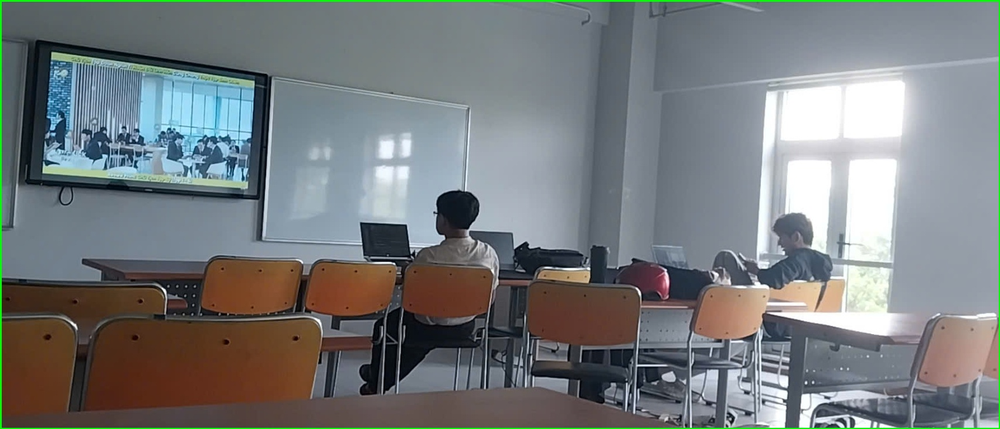
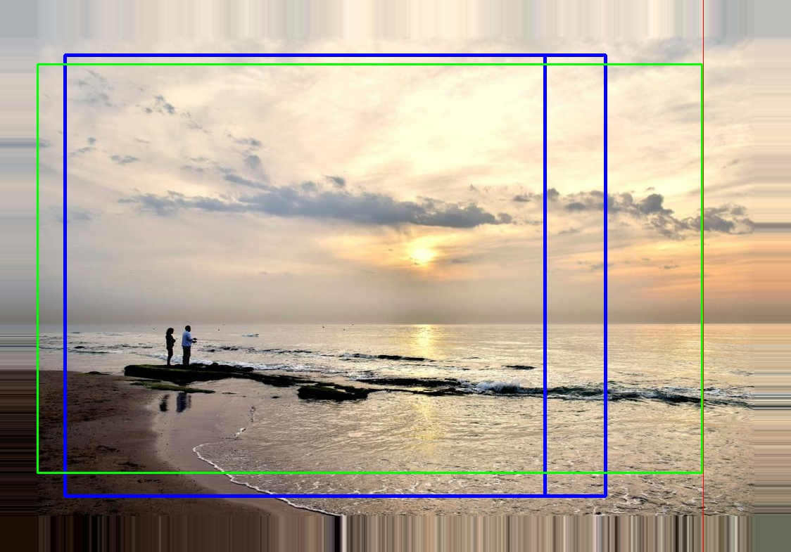

# AIL-Premium — Aesthetic Intelligence Lab

> **Dự án nghiên cứu:** Nâng cấp bài 034 (UNIC) lên tạp chí Q1 bằng Gaussian-Splatting-inspired Feature Extrapolation.
> **Target:** IEEE Transactions on Image Processing (Q1).

---

## Phần 1 — Baseline: UNIC (Bài 034)

### 1.1. Thông tin bài báo

- **Tên đầy đủ:** Beyond Image Borders: Learning Feature Extrapolation for Unbounded Image Composition
- **Tác giả:** Xiaoyu Liu, Ming Liu, Junyi Li, Shuai Liu, Xiaotao Wang, Lei Lei, Wangmeng Zuo
- **Đơn vị:** Harbin Institute of Technology, Peng Cheng Laboratory
- **Nơi:** arXiv 2309.12042 (Sep 2023)
- **GitHub:** https://github.com/liuxiaoyu1104/UNIC

### 1.2. Bài toán

Các phương pháp bố cục ảnh (image composition) hiện tại chỉ cắt ảnh trong biên đã chụp. Khi vùng đẹp nhất nằm ngoài biên ảnh, kết quả bắt buộc là thứ tối ưu. Out-painting (Zhong et al.) mở rộng biên bằng sinh pixel ảo nhưng gây artifact.

UNIC giải quyết bằng cách **ngoại suy đặc trưng (feature extrapolation)** trong latent space — dự đoán features cho vùng ngoài biên mà không sinh pixel thật.

### 1.3. Kiến trúc

```
I_init (RGB, 4:3 hoặc 3:4)
    │
    ▼
CNN Backbone (ResNet-50, ImageNet pretrained)
    │
    ▼
Z_vis [B, N_vis, D] — visible feature tokens
    │
    ▼
FEM (Feature Extrapolation Module)
    - 6 transformer blocks
    - 1 learnable token m
    - Cross-attention: Z_vis → Z_pad
    │
    ▼
Z_pad [B, N_pad, D] — extrapolated features
    │
    ▼
Z_all = [Z_vis; Z_pad]
    │
    ▼
Transformer Decoder + Anchor Queries
    │
    ├─► H_box → c_pred [x, y, w, h] (có thể vượt border)
    └─► H_conf → p_pred [0-1] (confidence)
```

### 1.4. Loss function

```
L_total = L_comp + L_extra

L_comp = L_reg + λ_IoU·L_IoU + λ_focal·L_focal
    - L_reg: L1 loss cho tọa độ bounding box
    - L_IoU: GIoU loss
    - L_focal: Focal loss cho confidence

L_extra = smooth-L1(Z_pad, sg(Z_out))
    - Z_out: features của vùng ngoài biên từ ảnh toàn cảnh (EMA model)
    - sg(): stop gradient
```

### 1.5. Dataset

Tái tạo từ GAICD và CPC bằng cách random crop:

| Dataset | Train | Test | Mô tả |
|---------|-------|------|-------|
| GAICD | 2,636 | 500 | Grid Anchor-based Image Cropping |
| CPC | 10,800 | — | Composition-Preserving Cropping (sparse labels) |
| FLMS | — | 500 | Flickr Logos (dùng để eval CPC-trained model) |

Ràng buộc khi tạo dữ liệu:
- Kích thước I_init ≥ 0.7 lần ảnh gốc
- IoU(v_init, v) ≥ 0.7
- Tỉ lệ 4:3 hoặc 3:4

### 1.6. Kết quả chính

| Metric | Dataset | UNIC | Best Previous |
|--------|---------|------|---------------|
| Acc₁/₅ (ε=0.85) | GAICD | **59.0%** | 53.5% (Zhong et al.) |
| Acc₁/₁₀ (ε=0.85) | GAICD | **72.8%** | 67.2% (Zhong et al.) |
| IoU ↑ | GAICD | **0.801** | 0.795 (Zhong et al.) |
| IoU ↑ | FLMS | **0.828** | 0.818 (Zhong et al.) |
| Acc₁/₅ (ε=0.90, cropping) | GAICD | **74.7%** | 72.0% (Jia et al.) |

### 1.7. Điểm yếu (từ Section 5 của paper + phân tích)

1. FEM chỉ 6 blocks + 1 learnable token → extrapolation "mù"
2. Single-shot, multi-step không converge (step 2→3: 19.3% → 19.3%)
3. Chỉ zoom + shift, không rotation
4. Loss "mù thẩm mỹ" — không có aesthetic guidance
5. Dataset nhỏ, không diverse
6. Không có phân tích lý thuyết

### 1.8. Cấu trúc code

```
UNIC/
├── main.py              # Entry point: train + eval
├── train.sh / test.sh   # Shell launchers
├── engine.py            # Training engine
├── models/
│   ├── conditional_detr.py   # cDETR backbone
│   ├── backbone.py           # ResNet-50
│   ├── transformer.py        # Encoder-decoder
│   ├── attention.py          # Attention mechanisms
│   ├── matcher.py            # Bipartite matching
│   └── QEM.py                # Quality Embedding Module
├── datasets/
│   ├── coco.py               # COCO-format loader
│   ├── transforms.py         # Augmentation
│   └── panoptic_eval.py      # Metrics
├── util/
│   ├── box_ops.py            # IoU, box conversion
│   └── misc.py               # Helpers
└── init_view/                # Initial view annotations
```

### 1.9. Hạ tầng thực nghiệm

**Modal Cloud GPU** — đã setup sẵn:

| Script | GPU | Cost | Duration | Mục đích |
|--------|-----|------|----------|----------|
| `modal_apps/034-reproduce/modal_app.py` | 2×T4 | ~$11.80 | ~10h | Full training 50 epochs |
| `modal_apps/034-run-results/modal_app.py` | T4 | ~$0.59 | ~1h | Evaluation GAICD test |

**Yêu cầu:** PyTorch 1.13.1+cu117, GAICD dataset (Google Drive), pretrained checkpoint.

### 1.10. Kết quả Inference Thực tế

Dưới đây là một số hình ảnh test thử nghiệm chạy qua baseline UNIC (Bài 034) đã được train:

**1. Inference tùy chỉnh trên 1 ảnh (Custom Inference)**
Code để sinh ảnh này nằm ở: [`modal_infer.py`](modal_infer.py)

| Ảnh gốc (`test.jpg`) | Hộp dự đoán (`test_predicted_box.jpg`) | Ảnh cắt (`test_predicted_crop.jpg`) |
|----------------------|----------------------------------------|-------------------------------------|
|  |  |  |

**2. Đánh giá Test Dataset (GAICD Test set)**
Code để sinh bộ ảnh này nằm ở: [`modal_apps/034-run-results/modal_app.py`](modal_apps/034-run-results/modal_app.py)

| Ảnh đầu vào (`215046_input.jpg`) | Ground Truth Bounding Box (`215046_gt_pre_best_out.jpg`) | Ảnh Cắt Thực tế (`215046_crop_out.jpg`) |
|----------------------------------|----------------------------------------------------------|-----------------------------------------|
|  |  |  |

---

## Phần 2 — Đề xuất nghiên cứu: Gaussian AFF

### 2.1. Tên bài báo

**"Aesthetic Feature Field: Gaussian-Splatting-Guided Feature Extrapolation for Unbounded Image Composition"**

### 2.2. Insight cốt lõi

FEM của UNIC extrapolate "mù" — 1 learnable token dự đoán toàn bộ vùng ngoài border không biết đâu là foreground, đâu là background. 

Từ bài 008 (3D Aesthetic Field), ta lấy ý tưởng **Gaussian Splatting** — biểu diễn scene bằng tập Gaussian, mỗi cái có spatial extent. Áp dụng vào 034: mỗi visible patch → 1 Gaussian trong feature space. Extrapolation = "splat" Gaussian ra vùng ngoài border.

### 2.3. Kiến trúc đề xuất

```
I_init (RGB)
    │
    ├─► CNN Backbone ──► Z_vis [B, N_vis, D]
    │
    └─► Depth Anything (frozen) ──► D_map [B, H, W]
                                        │
                                        ▼
                              Gaussian Tokenizer
                              Mỗi patch → Gaussian(μ, Σ, α, f)
                              μ = vị trí spatial
                              Σ = spatial extent (học từ depth)
                              α = importance/saliency
                              f = aesthetic feature (distill từ VEN)
                                        │
                                        ▼
                              Gaussian Extrapolator
                              Splat Gaussians → Z_pad [B, N_pad, D]
                                        │
                                        ▼
                              Z_all = [Z_vis; Z_pad]
                                        │
                                        ▼
                              Transformer Decoder
                                        │
                              ┌─────────┴─────────┐
                              ▼                   ▼
                           H_box               H_aes
                              │                   │
                           c_pred              score_aes
                              │                   │
                              └─────────┬─────────┘
                                        ▼
                              L_total = L_comp + λ₁L_extra + λ₂L_aes + λ₃L_depth
```

### 2.4. 3 Đóng góp dự kiến (Expected Contributions)

Đây là những điểm mới (novelties) cốt lõi của bài báo, được thiết kế để nâng cấp mô hình lên chuẩn tạp chí Q1 (IEEE TIP):

**C1: Ngoại suy đặc trưng bằng Gaussian Splatting (GS-FEM)**
- **Ý tưởng:** Thay thế module ngoại suy FEM cũ (chỉ đoán mù bằng 1 token) bằng không gian hạt Gaussian. Mỗi vùng ảnh nhìn thấy (visible patch) sẽ được biểu diễn thành 1 hạt Gaussian có vị trí (μ) và độ lan tỏa (Σ). Việc mở rộng ảnh (extrapolation) chính là "bắn" (splatting) các hạt này ra vùng ngoài biên.
- **Điểm mới (Novelty):** Lần đầu tiên mang khái niệm Gaussian Splatting (vốn dùng cho rendering 3D) ứng dụng vào việc ngoại suy đặc trưng (feature extrapolation) để phục vụ bài toán 2D image composition.

**C2: Chưng cất đặc trưng thẩm mỹ vào không gian Gaussian (Aesthetic Distillation)**
- **Ý tưởng:** Nếu chỉ bắn hạt Gaussian ra ngoài biên thì mô hình sẽ không biết vùng nào là "đẹp" để cắt. Ta sẽ chưng cất (distill) tri thức từ mạng đánh giá thẩm mỹ VEN vào các hạt Gaussian. Từ đó, mỗi hạt Gaussian sẽ mang theo một "điểm số thẩm mỹ" (aesthetic saliency).
- **Điểm mới (Novelty):** Kết hợp thành công kỹ thuật feature distillation phong cách 3DGS vào trong một kiến trúc 2D image composition, tạo ra một trường đặc trưng thẩm mỹ (Aesthetic Feature Field).

**C3: Gaussian tăng cường chiều sâu với chế độ kép (Depth-Enhanced Gaussian)**
- **Ý tưởng:** Dùng mô hình ước lượng chiều sâu (Depth Anything Small) để cung cấp giá trị khởi tạo cho kích thước (Σ) của các hạt Gaussian. Logic vật lý rất rõ ràng: Tiền cảnh (Foreground - gần) thì hạt nhỏ và sắc nét, Hậu cảnh (Background - xa) thì hạt to và mờ. 
- **Điểm mới (Novelty):** Khởi tạo Gaussian có định hướng chiều sâu (Depth-guided initialization), giúp mô hình có ý nghĩa vật lý thực tế và hội tụ nhanh hơn. Hỗ trợ thêm chế độ siêu nhẹ (Lightweight mode) dùng MiDaS Small (7.5M params) để chạy trên thiết bị yếu.

### 2.5. Loss function

```
L_total = L_comp + λ₁·L_extra + λ₂·L_aes + λ₃·L_depth
```

| Loss | Mục đích | λ |
|------|----------|---|
| L_comp | Regression + IoU + Focal (giữ nguyên UNIC) | 1.0 |
| L_extra | Smooth-L1: extrapolated vs EMA features | 1.0 |
| L_aes | MSE: predicted vs VEN aesthetic features | 0.1 |
| L_depth | Consistency: predicted vs Depth Anything | 0.01 |

### 2.6. Dataset

**KHÔNG cần tạo mới** — chỉ dùng public:

| Dataset | Ảnh | Role |
|---------|-----|------|
| GAICD | 2,636 train / 500 test | Primary eval |
| CPC | 10,800 train | Training supplement |
| FCDB | 10,000+ | Secondary eval |
| SACD | ~7,000 | Secondary eval |

### 2.7. Baseline comparisons

| Method | Type | Code |
|--------|------|------|
| UNIC (034) | Feature extrapolation | ✅ GitHub |
| UNIC + Depth only | Ablation | Same codebase |
| UNIC + Aesthetic only | Ablation | Same codebase |
| Jia et al. (cDETR) | Cropping-only | ✅ UNIC repo |
| Zhong et al. | Pixel-space out-painting | ❌ Reimplement |

### 2.8. Timeline

| Phase | Task | Time |
|-------|------|------|
| 1 | Reproduce UNIC | 2 tuần |
| 2 | Implement GS-FEM | 3 tuần |
| 3 | Aesthetic + Depth loss | 1 tuần |
| 4 | Train + ablation | 3 tuần |
| 5 | Eval + qualitative | 1 tuần |
| 6 | Write paper | 3 tuần |
| **Total** | | **~3 tháng** |

### 2.9. Đánh giá rủi ro

| Rủi ro | Giải pháp |
|--------|-----------|
| Depth Anything không improve nhiều | Dùng làm initialization, không hard-force |
| Gaussian representation quá phức tạp | Bắt đầu đơn giản: 1 patch = 1 Gaussian |
| Aesthetic loss không converge | VEN frozen, chỉ train Gaussian field |
| Resource hạn chế | GAICD nhỏ → batch size nhỏ vẫn được |

---

## Phần 3 — Các bài báo liên quan

### 3.1. 001 — Photography Perspective Composition (PPC)

- **Tác giả:** Lujian Yao et al. (vivo Mobile Communication)
- **Nơi:** NeurIPS 2025
- **Nội dung:** Giới thiệu PPC — paradigm mới vượt cropping 2D bằng perspective transformation 3D. Dùng I2V models (CogVideoX, Hunyuan, WAN2.1) để tạo video hướng dẫn chuyển từ góc kém → góc đẹp. PQA model (Qwen2-VL-2B) đánh giá 3 chiều: VQ, MQ, CA. RLHF (Flow-DPO) align với human preference.
- **Code:** Có thể đã public (vivoCameraResearch/PPC-Official), pretrained LoRA trên HuggingFace
- **Liên quan:** PQA reward model có thể dùng làm aesthetic signal; dataset generation pipeline có thể tham khảo
- **Đọc chi tiết:** `notes/001-overview.md`, `notes/001-pipeline.md`

### 3.2. 003 — Geometric Viewpoint Learning with Hyper-Rays

- **Tác giả:** (xem notes/003-overview.md)
- **Nơi:** ICCV 2023
- **Nội dung:** Học phân phối viewpoint con người từ point cloud indoor dùng hyper-rays trên S² và S³ (hyper-spherical harmonics).
- **Code:** Chưa xác nhận
- **Liên quan:** Viewpoint representation học từ dữ liệu — có thể tham khảo cho cách encode camera poses
- **Đọc chi tiết:** `notes/003-overview.md`, `notes/003-pipeline.md`

### 3.3. 004 — Image Aesthetic Assessment Based on Pairwise Comparison

- **Tác giả:** (xem notes/004-overview.md)
- **Nơi:** ICCV 2019
- **Nội dung:** Pairwise aesthetic comparator — Siamese ResNet-50 + eigenvalue decomposition để có continuous aesthetic score từ pairwise comparisons. Unified approach: score regression + binary + personalized aesthetics.
- **Code:** Chưa xác nhận
- **Liên quan:** Pairwise comparison framework có thể dùng cho personalized composition; aesthetic scoring methodology
- **Đọc chi tiết:** `notes/004-overview.md`, `notes/004-pipeline.md`

### 3.4. 008 — Aesthetic Camera Viewpoint Suggestion with 3D Aesthetic Field

- **Tác giả:** Sheyang Tang et al. (University of Waterloo)
- **Nơi:** arXiv 2602.20363 (Feb 2026)
- **Nội dung:** Giới thiệu 3D aesthetic field — distill aesthetic knowledge từ VEN vào feedforward 3D Gaussian Splatting. Two-stage search: coarse sampling (16 poses + 8 neighbors) + gradient ascent (25 steps). Kết quả: PLCC 0.836 vs 0.745 baseline trên RE10k.
- **Code:** Chưa xác nhận (mới Feb 2026)
- **Liên quan:** **Nguồn cảm hứng chính** cho Gaussian AFF — concept 3DGS + aesthetic distillation được áp dụng trực tiếp vào 034
- **Đọc chi tiết:** `notes/008-overview.md`, `notes/008-pipeline.md`

### 3.5. Tổng quan so sánh

| Chiều | 034 UNIC | 001 PPC | 008 3D Aesthetic Field |
|-------|----------|---------|------------------------|
| Input | 1 ảnh 2D | 1 ảnh 2D | 2-6 ảnh + camera poses |
| Scene model | Không có (2D features) | Video proxy (ViewCrafter) | 3D Gaussian Splatting |
| Aesthetic signal | Confidence score (human labels) | PQA reward (VQ+MQ+CA) | VEN distillation |
| Output | Bounding box 2D | Video camera movement | Camera pose 3D (5 DoF) |
| Dataset | GAICD, CPC | GAICD, SACD, FLMS, FCDB | RE10k, DL3DV |
| Code | ✅ Public | ⚠️ Có thể đã public | ❌ Chưa xác nhận |

### 3.6. Cross-paper analysis

Xem thêm:
- `notes/compare-001-008-034.md` — So sánh chi tiết 3 papers theo 9 chiều
- `notes/research-gap-unic-034.md` — 8 hạn chế, 6 gaps, 5 white spaces, 8 cơ hội
- `notes/analysis-complexity-reproducibility.md` — Đánh giá khả năng reproduce
- `notes/reading-triage-viewpoint-suggestion.md` — Xếp hạng ưu tiên đọc

---

## Phụ lục

### Cấu trúc thư mục

```
AIL-Premium/
├── README.md                    # This file
├── CLAUDE.md                    # Project context cho Claude Code
├── .gitignore
│
├── papers/                      # Source PDFs (4 papers)
│   ├── 001_Photography_Perspective_Composition_...pdf
│   ├── 003_Geometric_Viewpoint_Learning_...pdf
│   ├── 004_Image_Aesthetic_Assessment_...pdf
│   └── 008_Aesthetic_Camera_Viewpoint_...pdf
│
├── notes/                       # Paper analysis (Vietnamese, 17 files)
│   ├── INDEX.md                 # Chỉ mục đầy đủ
│   ├── 001-overview.md         # Tổng quan PPC
│   ├── 001-pipeline.md         # Pipeline PPC
│   ├── 001-vi.md               # Dịch toàn văn 001
│   ├── 003-overview.md         # Tổng quan HRE
│   ├── 003-pipeline.md         # Pipeline HRE
│   ├── 004-overview.md         # Tổng quan Pairwise
│   ├── 004-pipeline.md         # Pipeline Pairwise
│   ├── 008-overview.md         # Tổng quan 3D Aesthetic Field
│   ├── 008-pipeline.md         # Pipeline 3D Aesthetic Field
│   ├── 034-overview.md         # Tổng quan UNIC
│   ├── 034-pipeline.md         # Pipeline UNIC
│   ├── 034-summary.md          # Tóm tắt đầy đủ UNIC
│   ├── 034-vi.md               # Dịch toàn văn 034
│   ├── compare-001-008-034.md  # So sánh 3 papers
│   ├── research-gap-unic-034.md # Research gaps
│   ├── analysis-complexity-reproducibility.md
│   ├── reading-triage-viewpoint-suggestion.md
│   └── audit-log.md
│
├── UNIC/                        # Baseline code (fork từ liuxiaoyu1104/UNIC)
│   ├── README.md
│   ├── main.py                  # Train + eval entry point
│   ├── train.sh / test.sh
│   ├── models/                  # cDETR, backbone, transformer, FEM
│   ├── datasets/                # COCO loader, transforms
│   ├── util/                    # Box ops, metrics
│   └── init_view/               # Initial view annotations
│
├── modal_apps/                  # Cloud GPU setup
│   ├── 034-reproduce/           # Full training (2×T4, ~$11.80)
│   └── 034-run-results/         # Evaluation (T4, ~$0.59)
│
└── notebooks/
    └── 001-run-results.ipynb    # PPC inference
```

### Cách đóng góp

```bash
git clone https://github.com/VoDucNhatku/AIL-Premium.git
cd AIL-Premium
```

### Liên hệ

| Resource | Link |
|----------|------|
| UNIC Paper | arXiv:2309.12042 |
| UNIC GitHub | https://github.com/liuxiaoyu1104/UNIC |
| 008 Paper | arXiv:2602.20363 |
| 001 Paper | arXiv:2505.20655 |
