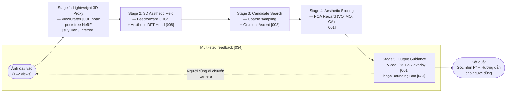

# So sánh — 001 · 008 · 034
> Phạm vi: 001, 008, 034 · Mode: Deep · Worker: compare-papers · Ngày: 2026-06-26

Bộ ba bài báo này cùng giải quyết bài toán **gợi ý điều chỉnh góc nhìn máy ảnh** (camera viewpoint adjustment/suggestion) nhưng ở các phạm vi và giả định khác nhau căn bản: 034 hoạt động thuần 2D trong không gian đặc trưng; 001 kết hợp video sinh từ ảnh đơn để biểu diễn biến đổi góc nhìn 3D; 008 mô hình hóa thẩm mỹ trực tiếp trong không gian 3D liên tục. Điểm hội tụ chung là cả ba đều tránh yêu cầu dense 3D reconstruction và đều nhắm đến việc hướng dẫn người dùng lúc chụp ảnh (not post-processing).

---

## 1. Bảng so sánh (Comparison table)

| Chiều | 034 — UNIC | 001 — PPC | 008 — 3D Aesthetic Field |
|---|---|---|---|
| **Input representation** | Ảnh đơn 2D $`\mathbf{I}_{init}`$ (kích thước giới hạn); không có thông tin 3D [034§3.1] | Ảnh đơn 2D (góc nhìn kém thẩm mỹ); không cần camera pose [001§1] | $`N \in \{2,4,6\}`$ ảnh thưa + camera poses $`\{\mathbf{P}^i\}`$ từ COLMAP/GPS [008§4] |
| **Scene/geometry model** | Không có; làm việc hoàn toàn trong không gian đặc trưng 2D [034§3.2] | Không có 3D scene model; dùng ViewCrafter để tạo video proxy [001§3.1] | 3D Gaussian Splatting feedforward; mỗi Gaussian mang aesthetic embedding $`\mathbf{f}_{aes} \in \mathbb{R}^{32}`$ [008§3.2] |
| **Aesthetic signal** | $`H_{conf}`$ head dự đoán confidence score $`p_{pred}`$ dùng làm aesthetic proxy khi chọn và rank candidate box; $`p_{pred}`$ học từ Focal Loss trên crop quality labels của GAICD/CPC (human-annotated) [034§3.2, §3.4] | PQA reward model (Qwen2-VL-2B) chấm điểm video theo VQ, MQ, CA [001§3.3] | Teacher VEN (frozen CNN) chắt lọc tri thức thẩm mỹ 2D vào 3D Gaussians [008§3.1] |
| **Core method** | cDETR + FEM: ngoại suy đặc trưng $`\mathcal{Z}_{vis} \to \mathcal{Z}_{pad}`$, hồi quy trực tiếp bounding box $`\mathbf{c}_{pred}`$ [034§3.2–3.3] | I2V generation (Wan2.1/CogVideoX/HunYuan) fine-tuned với Flow-DPO/RLHF [001§3.2] | Feedforward 3DGS + aesthetic DPT head → 2-stage search (coarse sampling + gradient ascent) [008§3.3] |
| **Loss function(s)** | $`\mathcal{L} = \mathcal{L}_{comp} + \mathcal{L}_{extra}`$; với $`\mathcal{L}_{comp} = \mathcal{L}_{reg} + \lambda_{IoU}\mathcal{L}_{IoU} + \lambda_{focal}\mathcal{L}_{focal}`$; $`\mathcal{L}_{extra} = \mathrm{smooth}_{L_1}(\mathcal{Z}_{pad},\,sg(\mathcal{Z}_{out}))`$ [034§3.3 eq.5–7] | Flow-DPO: $`\mathcal{L}_{FD}(\theta) = -\mathbb{E}[\log\sigma(-\frac{\beta_t}{2}(\ldots))]`$ trên cặp win/lose video; BTT loss cho PQA reward [001§3.2 eq.1–2, §3.3] | $`\mathcal{L}_{distill} = \lVert \mathbf{F}_{pred} - \mathbf{F}_{gt} \rVert_2^2`$ (MSE feature distillation từ teacher VEN layer 23) [008§3.2] |
| **Output** | Bounding box $`\mathbf{c}_{pred}`$ (có thể nằm ngoài biên $`\mathbf{I}_{init}`$) + confidence $`p_{pred}`$; suy ra camera movement 2D [034§3.1] | Video camera movement (dẫn từ góc kém → góc tốt) + guidance box AR overlay [001§3.2] | Camera pose $`\mathbf{P}^*`$ trong không gian 3D (5 DoF: 3D translation + yaw + pitch) [008§3.3] |
| **Evaluation protocol** | Acc1/5, Acc1/10 (với $`\epsilon \in \{0.85, 0.90\}`$), IoU, Boundary Displacement (Disp) [034§4.1] | CMM, FVD, PSNR, SSIM, LPIPS; human scores VQ, MQ, CA [001§4] | PLCC, SRCC (aesthetic prediction); VEN↑, SAMPNet↑ (viewpoint suggestion quality) [008§4] |
| **Dataset(s)** | GAICD (2636/200/500), FLMS; dataset mới do tác giả tạo từ GAICD và CPC [034§3.4, §4.1] | GAICD, SACD, FLMS, FCDB, Unsplash (data generation); PQA: ~5K/15K videos [001§3.1] | RealEstate10k (RE10k), DL3DV; camera poses từ metadata [008§4] |
| **Headline metric** | IoU = 0.801 (GAICD unbounded); $`Acc_{1/5}(\epsilon=0.85)`$ = 59.0% [034§4.2] | CMM = 0.599 (Wan2.1); CA = 0.734 sau RLHF [001 Table 2, Table 4] | PLCC = 0.796 (RE10k); VEN = 2.03 (vs 1.61 UNIC baseline) [008§4.1–4.2] |

---

### Các chiều phân kỳ chính (Key differentiators)

**1. Biểu diễn cảnh (Scene representation):** Đây là chiều phân kỳ lớn nhất. 034 hoàn toàn bỏ qua cấu trúc 3D, làm việc thuần trong feature space 2D. 001 dùng video proxy (ViewCrafter) để gần đúng biến đổi 3D nhưng không có explicit scene model. 008 là phương pháp duy nhất có biểu diễn cảnh 3D tường minh (3DGS), cho phép suy luận aesthetic tại *bất kỳ* pose nào trong vùng quan sát. Hệ quả: 008 có khả năng tổng quát hóa góc nhìn tốt nhất nhưng yêu cầu camera poses; 034 dễ deploy nhất nhưng chỉ có thể gợi ý chuyển động 2D (dịch chuyển + zoom).

**2. Tín hiệu thẩm mỹ (Aesthetic signal source):** 034 dùng nhãn human annotation tĩnh từ dataset cropping (không có explicit aesthetic model). 001 xây dựng PQA reward model chuyên biệt (Qwen2-VL-2B) với 3 chiều đánh giá (VQ, MQ, CA), đặc biệt nhấn mạnh CA — cải thiện thẩm mỹ *xuyên suốt* video transformation. 008 chắt lọc (distill) từ teacher VEN vào 3D space. Hệ quả: 001 có tín hiệu thẩm mỹ phong phú nhất (3 chiều, video-level); 008 có tín hiệu thẩm mỹ 3D-aware nhất; 034 phụ thuộc vào chất lượng của dataset annotation.

**3. Phạm vi điều chỉnh góc nhìn (Viewpoint adjustment scope):** 034 giới hạn ở dịch chuyển 2D và zoom (không thay đổi camera pose thực sự) [034§5]. 001 có thể biểu diễn bất kỳ camera movement nào trong không gian 3D (rotation, translation) nhờ I2V model [001§3.2]. 008 tìm kiếm trong không gian 5 DoF liên tục (3D translation + yaw + pitch) [008§3.3]. Hệ quả: 008 và 001 có phạm vi gợi ý rộng hơn nhiều so với 034.

---

## 2. Phân tích tường thuật (Narrative analysis)

### 034 — UNIC (Unbounded Image Composition)

**Điểm mạnh:** UNIC giới thiệu một thiết kế đơn giản và thực dụng: ngoại suy trong không gian đặc trưng (feature space) thay vì không gian ảnh (pixel space), cho phép dự đoán hộp cắt xén vượt ngoài biên ảnh mà không sinh ra pixel giả chứa artifact — đây là đóng góp kỹ thuật rõ ràng nhất của bài [034§3.3]. Thiết kế end-to-end trên kiến trúc cDETR làm cho hệ thống nhẹ và dễ deploy trong môi trường mobile [034§4.1].

**Hạn chế:** Phạm vi điều chỉnh góc nhìn của UNIC bị giới hạn nghiêm trọng: chỉ dịch chuyển 2D và zoom, không thể gợi ý thay đổi hướng máy ảnh thực sự [034§5]. Điều này làm cho UNIC không thể giải quyết các trường hợp cần thay đổi perspective thực sự (ví dụ: từ góc chụp trán sang góc chụp nghiêng, hoặc di chuyển xung quanh đối tượng).

**Quyết định kỹ thuật then chốt:** Việc ràng buộc $`\mathbf{v}_{pred}`$ và $`\mathbf{c}_{pred}`$ chia sẻ tâm và một chiều theo tỉ lệ camera cố định [034§3.1 eq.2–3] là đơn giản hóa then chốt — nó biến bài toán kép thành một bài toán hồi quy hộp duy nhất, giải thích tại sao UNIC đơn giản nhưng hiệu quả trong phạm vi 2D.

---

### 001 — PPC (Photography Perspective Composition)

**Điểm mạnh:** PPC là phương pháp duy nhất trong bộ ba tạo ra *video* biến đổi góc nhìn có thể trực tiếp hướng dẫn người dùng di chuyển camera theo thời gian thực, đồng thời có guidance box AR overlay [001§3.2]. PQA reward model với 3 chiều (VQ, MQ, CA) và RLHF/Flow-DPO là tín hiệu thẩm mỹ phong phú nhất và được thiết kế riêng cho video camera movement [001§3.3].

**Hạn chế:** Pipeline của PPC cực kỳ phức tạp và tốn kém: phải có ViewCrafter 3D reconstruction, I2V backbone 5B–17B parameters, PQA training với 15K video, và RLHF fine-tuning [001§3.1–3.2]. Chi phí inference cao và phụ thuộc vào chất lượng 3D reconstruction (artifact, distortion, blur được tác giả thừa nhận) [001§5].

**Quyết định kỹ thuật then chốt:** Sử dụng Reverse Video trick (well-composed → less-favorable → đảo ngược) để tạo training data PPC tự động mà không cần annotation thủ công [001§3.1] là giải pháp sáng tạo nhất của bài — nó giải quyết hoàn toàn vấn đề thiếu dữ liệu cho bài toán mới.

---

### 008 — 3D Aesthetic Field

**Điểm mạnh:** 008 là phương pháp duy nhất có *continuous 3D aesthetic field* — khả năng dự đoán aesthetic score tại bất kỳ pose nào trong không gian 3D liên tục — cho phép gradient ascent tìm kiếm góc nhìn tối ưu một cách nguyên lý [008§3.2–3.3]. Kết quả VEN = 2.03 vượt xa UNIC (1.61) trong cùng điều kiện so sánh [008 Table 2], xác nhận ưu thế của biểu diễn 3D.

**Hạn chế:** Yêu cầu camera poses (từ COLMAP hoặc GPS/IMU) là rào cản triển khai lớn nhất — không hỗ trợ pose-free settings [008§5]. Vùng tìm kiếm viewpoint bị giới hạn trong vùng có sparse observations, không thể khám phá góc nhìn hoàn toàn mới ngoài vùng đó [008§5].

**Quyết định kỹ thuật then chốt:** Feature distillation từ layer 23 của teacher VEN vào 32-dim aesthetic embedding per-Gaussian [008§3.2] là thiết kế tinh tế — thay vì chạy VEN đầy đủ ở mỗi novel view (tốn kém), hệ thống học cách encode aesthetic knowledge vào 3D representation và suy ra score qua rendering, giải thích tại sao gradient ascent trên aesthetic score khả thi và hiệu quả.

---

## 3. Đề xuất pipeline kết hợp (Suggested hybrid pipeline)

**Mục tiêu hybrid:** Hệ thống gợi ý góc nhìn thẩm mỹ có thể hoạt động với đầu vào tối thiểu (1–2 ảnh từ smartphone, không cần GPS/IMU bắt buộc), đưa ra gợi ý 3D-aware, và hướng dẫn người dùng bằng video/AR overlay trong thời gian thực.

### Lý do chọn từng thành phần (Component rationale)

| Stage | Nguồn | Lý do chọn |
|---|---|---|
| Stage 1: 3D Proxy | [001§3.1] (ViewCrafter) | PPC đã chứng minh ViewCrafter khả thi cho single/dual-image 3D reconstruction không cần dense captures. Là thành phần có thể thay thế bằng pose-free method khi poses không có sẵn. |
| Stage 2: 3D Aesthetic Field | [008§3.2] (Feedforward 3DGS + DPT Head) | 008 chứng minh feedforward 3DGS học được aesthetic field chỉ từ 2–6 views; distillation từ VEN teacher ổn định và không cần human annotation. PLCC=0.796 vs baseline 0.657 [008 Table 1]. |
| Stage 3: Candidate Search | [008§3.3] (2-stage: coarse + gradient ascent) | Gradient ascent trên differentiable 3DGS cho ΔVEN=+0.46 vs +0.20 baseline [008 Table 3] — hiệu quả nhất trong tìm kiếm góc nhìn liên tục. |
| Stage 4: Aesthetic Scoring | [001§3.3] (PQA: VQ+MQ+CA) | PQA xét đến chiều CA (composition improvement throughout video) — tín hiệu phong phú hơn single-frame scoring. Dùng làm secondary filter sau gradient ascent. |
| Stage 5: Guidance Output | [001§3.2] (I2V + AR overlay) | Video guidance + guidance box là giao diện trực quan nhất cho người dùng smartphone; guidance box từ [034] là fallback nhẹ hơn nếu I2V quá chậm. |
| Multi-step Feedback | [034§4] (multi-step adjustment) | Vòng lặp điều chỉnh nhiều bước của 034 (IoU tăng 0.721→0.852 qua 3 steps) áp dụng tự nhiên vào toàn bộ hybrid pipeline. |

### Rủi ro tích hợp (Integration risks)

1. **Mismatch coordinate frame:** 008 làm việc trong pose space 3D (3×4 matrix), trong khi 034 và 001 làm việc với 2D bounding box hoặc implicit camera movement. Cần một lớp projection để chuyển đổi $`\mathbf{P}^*`$ (008) sang guidance box 2D (034) hoặc video prompt (001).

2. **Camera pose availability:** 008 yêu cầu poses đầu vào; ViewCrafter từ [001] có thể cung cấp poses gần đúng, nhưng sai số tích lũy có thể làm suy giảm chất lượng 3D Aesthetic Field [suy luận / inferred].

3. **Latency:** Pipeline đầy đủ (ViewCrafter + 3DGS + I2V) quá nặng cho real-time mobile. Cần distillation thêm hoặc fallback về mode 034-only (FEM inference) khi tài nguyên hạn chế [suy luận / inferred].

4. **Training data incompatibility:** 008 train trên RE10k/DL3DV (indoor video); 001 train trên ảnh chuyên nghiệp (GAICD, Unsplash); 034 train trên dataset cropping. Fine-tune aesthetic field trên domain photography sẽ cần dataset mới [suy luận / inferred].

---

## 4. Đề xuất cải thiện từng bài (Per-paper improvements)

### 034 — UNIC

**1. Mở rộng phạm vi điều chỉnh sang 3D camera pose**

- **Vấn đề hiện tại:** UNIC chỉ hỗ trợ dịch chuyển 2D và zoom; bản thân tác giả thừa nhận "camera operations are limited to shifts and zoom, without camera pose changes" [034§5].
- **Nguồn cải thiện:** 008 đã chứng minh gradient ascent trên 5 DoF (3D translation + yaw + pitch) cho ΔVEN=+0.46 chỉ sau 25 steps [008§3.3 Table 3].
- **Cách áp dụng:** Thay vì chỉ hồi quy 2D bounding box, thêm một nhánh pose regression head vào decoder của cDETR để dự đoán rotation offset $`\Delta\mathbf{R}`$ và translation $`\Delta\mathbf{t}`$. FEM có thể giữ nguyên — nó vẫn cung cấp context cho vùng ngoài biên. Supervision có thể lấy từ dataset ViewCrafter của 001.
- **Rủi ro:** cDETR không có inductive bias cho 3D geometry; cần thêm depth signal hoặc metric depth estimation làm auxiliary input để pose regression có ý nghĩa hình học.

**2. Thay thế nhãn annotation bằng PQA reward**

- **Vấn đề hiện tại:** UNIC dùng human-annotated crops từ GAICD/CPC; tín hiệu thẩm mỹ là binary (crop hay không crop) không có continuous aesthetic score [034§3.4].
- **Nguồn cải thiện:** PQA của 001 cung cấp continuous reward (VQ, MQ, CA) theo framework BTT, đặc biệt chiều CA đánh giá cải thiện bố cục [001§3.3].
- **Cách áp dụng:** Thêm loss term $`\mathcal{L}_{CA} = -r_{CA}(\mathbf{c}_{pred})`$ vào hàm mất mát của UNIC, trong đó $`r_{CA}`$ là PQA reward cho chiều composition aesthetic. Cần adapt PQA để nhận image crop thay vì video.
- **Rủi ro:** PQA được train để đánh giá video transformation, không phải static crop — có thể cần fine-tune thêm trên dataset ảnh đơn.

**3. Tích hợp 3D feature từ teacher model**

- **Vấn đề hiện tại:** FEM của UNIC ngoại suy từ các token visible mà không có prior thẩm mỹ nào về vùng ngoài biên [034§3.3].
- **Nguồn cải thiện:** 008 chứng minh distillation từ VEN teacher vào feature representation cải thiện đáng kể aesthetic prediction (PLCC 0.657 → 0.796) [008§3.2 Table 1].
- **Cách áp dụng:** Thêm aesthetic distillation loss $`\mathcal{L}_{aes} = \lVert \phi_{VEN}(\mathbf{I}_{init}) - f_{aes}(\mathcal{Z}_{vis}) \rVert_2^2`$ để guide FEM học ngoại suy không chỉ dựa trên cấu trúc ảnh mà còn theo aesthetic features của teacher VEN.
- **Rủi ro:** Thêm loss term tăng complexity training; balance giữa $`\mathcal{L}_{comp}`$, $`\mathcal{L}_{extra}`$, và $`\mathcal{L}_{aes}`$ cần tuning cẩn thận.

---

### 001 — PPC

**1. Thêm 3D aesthetic field để ổn định reward signal**

- **Vấn đề hiện tại:** PQA reward của PPC là frame-level hoặc video-level scoring — không có explicit 3D geometric prior, dễ bị nhiễu bởi rendering artifacts từ ViewCrafter [001§5].
- **Nguồn cải thiện:** 008 chứng minh 3D Aesthetic Field (distilled vào Gaussians) cho signal ổn định hơn raw RGB rendering (PLCC=0.796 vs 0.657 baseline) [008 Table 1].
- **Cách áp dụng:** Trong pipeline dataset generation của 001, thay vì chỉ dùng PQA để filter video (Stage A4), thêm 3D Aesthetic Field (từ 008) để score các candidate camera poses *trước khi* render video. Điều này giúp loại bỏ camera trajectories kém thẩm mỹ sớm hơn và giảm burden cho PQA.
- **Rủi ro:** 008 yêu cầu camera poses rõ ràng; trong dataset generation của 001, poses từ ViewCrafter có thể không đủ chính xác để xây dựng 3D Aesthetic Field ổn định [suy luận / inferred].

**2. Thêm unbounded composition loss từ UNIC**

- **Vấn đề hiện tại:** PPC tối ưu camera movement nhưng không có explicit supervision về vị trí bố cục (composition box) trong frame cuối — chỉ CA score tổng thể [001§3.3].
- **Nguồn cải thiện:** UNIC cung cấp $`\mathcal{L}_{comp}`$ (GIoU + L1 + focal) cho phép train với explicit crop ground truth, đã chứng minh hiệu quả trong unbounded setting [034§3.2 eq.5].
- **Cách áp dụng:** Thêm auxiliary composition regression head vào frame cuối của I2V video, supervised bởi ground-truth crop từ dataset GAICD. Loss tổng: $`\mathcal{L}_{total} = \mathcal{L}_{FD} + \lambda \mathcal{L}_{comp}`$.
- **Rủi ro:** Cần ground-truth crop alignment cho frame cuối của video — không phải lúc nào camera trajectory cũng kết thúc tại một crop rõ ràng.

**3. Multi-step inference loop từ UNIC**

- **Vấn đề hiện tại:** PPC inference là single-pass (một ảnh vào → một video ra); không có cơ chế phản hồi từ góc nhìn mới thu thập được [001§3.2].
- **Nguồn cải thiện:** UNIC chứng minh multi-step adjustment cải thiện IoU từ 0.721 (step=1) → 0.852 (step=3) [034§4.4]; logic lặp đơn giản nhưng hiệu quả.
- **Cách áp dụng:** Sau khi người dùng di chuyển camera theo video hướng dẫn đầu tiên, tự động chụp ảnh mới và feed vào PPC pipeline để generate video guidance tiếp theo. Lặp cho đến khi PQA score vượt ngưỡng định trước (ví dụ CA ≥ 0.80).
- **Rủi ro:** Mỗi vòng lặp cần I2V inference (~vài giây trên GPU mạnh), nặng hơn nhiều so với UNIC (inference nhẹ). Cần distillation để giảm latency.

---

### 008 — 3D Aesthetic Field

**1. Loại bỏ yêu cầu camera poses bằng pose estimation**

- **Vấn đề hiện tại:** 008 yêu cầu camera poses $`\{\mathbf{P}^i\}`$ từ COLMAP hoặc GPS/IMU — không khả thi trên smartphone thông thường [008§5].
- **Nguồn cải thiện:** Pipeline 001 đã tích hợp ViewCrafter để ước lượng 3D geometry và camera trajectories từ ảnh đơn, không cần poses tường minh [001§3.1].
- **Cách áp dụng:** Tích hợp bước pose estimation vào Stage 0 của 008: dùng dust3r/MASt3R hoặc ViewCrafter để ước lượng relative poses từ 2 ảnh đầu vào trước khi feed vào Multiview Transformer. Điều này biến 008 thành pose-free system.
- **Rủi ro:** Pose estimation error lan truyền vào 3D Aesthetic Field; cần đánh giá sensitivity analysis để biết mức độ error cho phép [suy luận / inferred].

**2. Thêm video-based aesthetic signal từ PQA**

- **Vấn đề hiện tại:** 008 chỉ dùng VEN (frame-level aesthetic model) làm teacher — không xét cải thiện thẩm mỹ *theo thời gian* (trajectory-level aesthetic) [008§3.1].
- **Nguồn cải thiện:** PQA của 001 với chiều CA đánh giá cải thiện bố cục xuyên suốt video transformation — là tín hiệu phù hợp hơn cho bài toán gợi ý góc nhìn [001§3.3].
- **Cách áp dụng:** Thay teacher VEN bằng (hoặc kết hợp với) PQA-CA: distill trajectory-level aesthetic signal từ PQA vào 3D Aesthetic Field bằng cách supervision trên cặp poses (start → end) thay vì single-view score. Loss: $`\mathcal{L}_{distill} = \lVert \mathbf{F}_{pred} - \mathbf{F}_{gt,CA} \rVert_2^2`$ với $`\mathbf{F}_{gt,CA}`$ từ PQA encoder.
- **Rủi ro:** PQA-CA được train trên video transformer (Qwen2-VL-2B) — extract intermediate feature representation có thể phức tạp và cần adapter để align với aesthetic embedding 32-dim của 008.

**3. Thêm unbounded search space bằng FEM**

- **Vấn đề hiện tại:** Vùng tìm kiếm viewpoint của 008 bị giới hạn trong vùng có sparse observations; không thể explore các góc nhìn hoàn toàn ngoài vùng đó [008§5].
- **Nguồn cải thiện:** FEM của 034 đã chứng minh có thể ngoại suy features sang vùng không nhìn thấy được trong ảnh 2D [034§3.3].
- **Cách áp dụng:** Thêm feature extrapolation module tương tự FEM vào 3D Aesthetic Field: với các Gaussians tại vùng ngoài observation range, dùng cross-attention từ observed Gaussians để dự đoán aesthetic embeddings $`\mathbf{f}_{aes}`$ cho vùng extrapolated. Supervision bằng smooth-$`\ell_1`$ loss tương tự $`\mathcal{L}_{extra}`$ của 034 [034§3.3 eq.6].
- **Rủi ro:** FEM trong 034 hoạt động trên 2D token grid; mở rộng sang 3D Gaussian space đòi hỏi redesign kiến trúc và chưa có precedent trong literature [suy luận / inferred].

---

## Thuật ngữ (Glossary)

| English | Tiếng Việt | Giải thích ngắn |
|---|---|---|
| Unbounded Image Composition | Bố cục ảnh không giới hạn biên | Bố cục ảnh mà hộp cắt xén có thể nằm ngoài biên ảnh ban đầu [034] |
| Feature Extrapolation Module (FEM) | Mô-đun ngoại suy đặc trưng | Module trong UNIC dự đoán token đặc trưng cho vùng ngoài biên [034] |
| Photography Perspective Composition (PPC) | Bố cục ảnh dựa trên phối cảnh | Paradigm biến đổi góc nhìn máy ảnh thực trong 3D để cải thiện bố cục [001] |
| 3D Aesthetic Field | Trường thẩm mỹ 3D | Biểu diễn liên tục ánh xạ camera pose → điểm thẩm mỹ trong không gian 3D [008] |
| 3D Gaussian Splatting (3DGS) | Kết xuất Gaussian 3D | Biểu diễn cảnh 3D bằng tập Gaussian; trong 008 mỗi Gaussian mang aesthetic embedding |
| Feature Distillation | Chắt lọc đặc trưng | Chuyển tri thức từ teacher model sang student qua MSE loss trên feature space [008] |
| Flow-DPO | Flow-DPO | RLHF alignment loss cho Rectified Flow video model [001] |
| Perspective Quality Assessment (PQA) | Đánh giá chất lượng phối cảnh | Reward model (Qwen2-VL-2B) đánh giá video camera movement theo VQ, MQ, CA [001] |
| Composition Aesthetic (CA) | Thẩm mỹ bố cục | Chiều đánh giá cải thiện bố cục xuyên suốt video transformation [001] |
| Gradient Ascent | Leo gradient | Tối ưu cực đại aesthetic score trực tiếp trên camera pose space [008] |
| cDETR | cDETR | Conditional DETR — kiến trúc detection transformer làm backbone UNIC [034] |
| ViewCrafter | ViewCrafter | Mô hình 3D reconstruction + novel view synthesis từ ảnh đơn, dùng trong PPC [001] |
| Coarse Sampling | Lấy mẫu thô | Giai đoạn 1 tìm kiếm viewpoint trong 008: sinh ~128 candidates dọc camera trajectory |
| Multi-step Adjustment | Điều chỉnh nhiều bước | Vòng lặp inference của 034: mỗi bước nhận ảnh mới từ góc nhìn gợi ý trước |
| GAICD | GAICD | Grid Anchor-based Image Cropping Dataset — dataset dùng trong cả 034 và 001 |
| BTT Loss | Hàm mất mát Bradley-Terry có hoà | Loss cho pairwise aesthetic comparison trong PQA [001] |
| Smooth-$`\ell_1`$ Loss | Hàm mất mát smooth-$`\ell_1`$ | Loss supervision cho FEM của UNIC — bền với outliers [034] |
| VEN | Visual Enjoyability Network | Mô hình thẩm mỹ 2D dùng làm teacher cho 008; cũng là evaluation metric |
